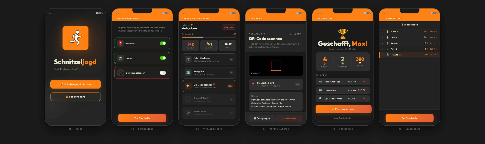

# m335-schnitzeljagd
together with my habibis leandro and timo

# TODO
## Implement:
- Finish Task Overview
- Implement Permissions Request
- Implement Timer per Task and Timer overall
- Implement Result Schnitzel / Schnitzel and Kartoffel / Nothing per Task and Visuall Sign that the task ist finished
- Implement Naming and Saving runs / displaying on leaderboard

## Fix
- Delete unused Permission
- Permission Removal
- Buggy Geolocation 02
- No Vibrate on Completion
  
